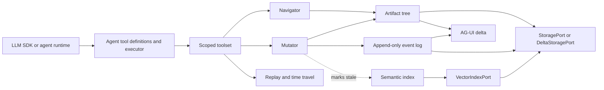

# Architecture

ArborKit keeps one canonical JSON artifact and projects navigation, mutation,
history, semantic search, persistence, and agent tools around the same node IDs.

## Core components

| Component | Responsibility |
| --- | --- |
| `ArtifactTree` | Decomposes JSON into stable, addressable nodes and reconstructs subtrees. |
| `Addressing` | Resolves node IDs and JSON Pointer paths. |
| `Mutator` | Applies guarded writes and records reversible mutation events. |
| `Navigator` | Describes, reads, and finds nodes without exposing live mutable values. |
| `SemanticIndex` | Tracks stale embeddings and searches through a pluggable vector port. |
| `Replay` | Reconstructs, diffs, and restores past states from the event log. |
| `Toolset` | Applies read/write scopes and converts failures into structured results. |
| `agent-tools` | Exposes provider-neutral JSON Schema definitions and a never-throw executor. |
| Storage ports | Persist a full artifact or a checkpoint plus append-only journal. |

## Write sequence

1. A caller resolves a node by stable ID or path.
2. Scope and optional optimistic-version guards are checked.
3. Type validation runs against a cloned proposed value.
4. The tree changes synchronously.
5. A reversible event is appended with actor and timestamp.
6. Affected semantic units become stale; embedding remains off the mutation path.
7. Persistence happens when the application calls `save`, `saveDelta`, or `checkpoint`.

## Important invariants

- Agent-facing methods return `ToolResult`; expected failures do not throw across
  that boundary.
- Reads return independent values rather than references into the live tree.
- Transactions restore tree, event log, and semantic queues together on failure.
- Revert appends a new mutation instead of erasing history.
- Semantic mutations are asynchronous: a write marks nodes stale and `reindex`
  later updates vectors.
- Restoring a delta journal requires the same type registry and decomposition
  policy used by the original process.

